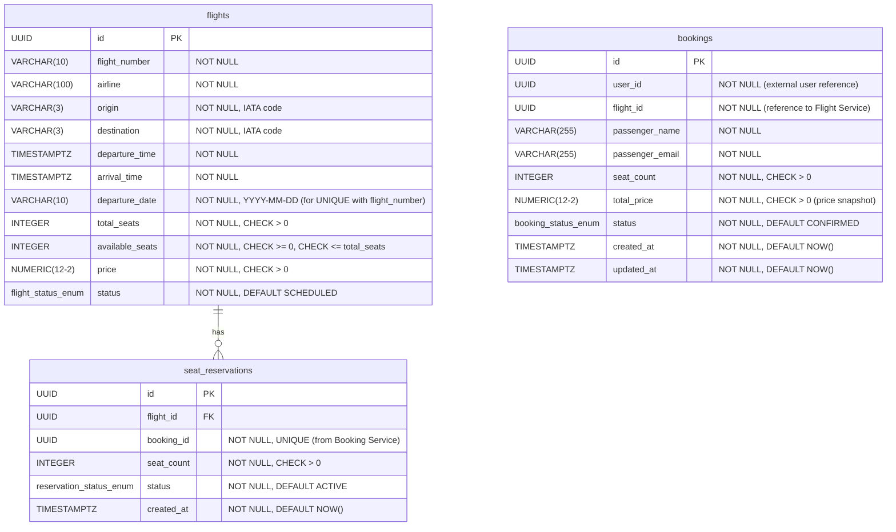

# ER Diagram — Flight Booking System (3NF)

## 3NF Compliance

| Table | 1NF | 2NF | 3NF |
|---|---|---|---|
| `flights` | All columns atomic; PK = `id` | Single-column PK — trivially satisfied | No transitive deps: `departure_date` is derived from `departure_time` but stored for efficient UNIQUE constraint and indexing — all non-key attributes depend only on `id` |
| `seat_reservations` | All columns atomic; PK = `id` | Single-column PK | `status` and `seat_count` depend only on `id`; `booking_id` is a cross-service foreign key (no FKC in DB, enforced by app logic) |
| `bookings` | All columns atomic; PK = `id` | Single-column PK | `total_price` is a **price snapshot** (not computed from `flight_id` at query time), so no transitive dependency; all attributes depend only on `id` |

## Constraints Summary

| Constraint | Table | Rule |
|---|---|---|
| `ck_flights_total_seats_positive` | `flights` | `total_seats > 0` |
| `ck_flights_available_seats_nonneg` | `flights` | `available_seats >= 0` |
| `ck_flights_available_lte_total` | `flights` | `available_seats <= total_seats` |
| `ck_flights_price_positive` | `flights` | `price > 0` |
| `uq_flight_number_date` | `flights` | `UNIQUE(flight_number, departure_date)` |
| `uq_seat_reservations_booking_id` | `seat_reservations` | `UNIQUE(booking_id)` — one reservation per booking |
| `ck_reservations_seat_count_positive` | `seat_reservations` | `seat_count > 0` |
| `ck_bookings_seat_count_positive` | `bookings` | `seat_count > 0` |
| `ck_bookings_total_price_positive` | `bookings` | `total_price > 0` |
